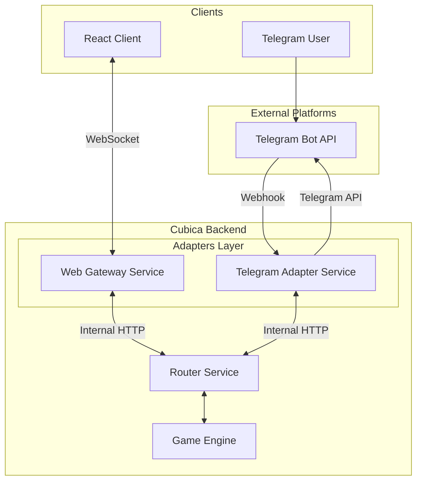

# Architecture Design: View Adapters

## 1. Overview

Система **View Adapters** отвечает за доставку игрового контента пользователю и получение обратной связи, скрывая детали конкретной платформы (Web, Telegram, Discord) от игрового движка.

Архитектура построена на принципе **Microservices**, где каждый адаптер является независимым сервисом.

## 2. Architecture Diagram



## 3. Component Responsibilities

### 3.1 Router Service
*   Ядро маршрутизации.
*   Не знает о специфике платформы (HTML vs Text).
*   Оперирует абстрактными объектами `ClientRequest` и `ViewCommand`.
*   Хранит маппинг `SessionID -> AdapterURL`.

### 3.2 Web Gateway Service
*   **Тип:** WebSocket Server / HTTP API.
*   **Роль:** Поддерживает stateful-соединение с браузером.
*   **Функции:**
    *   Аутентификация JWT токенов.
    *   Трансляция WebSocket сообщений в HTTP-запросы к Router (опционально, или прямое проксирование).
    *   Бродкаст обновлений стейта в WebSocket каналы.

### 3.3 Telegram Adapter Service
*   **Тип:** HTTP Service (Stateless).
*   **Роль:** Интерфейс к Telegram Bot API.
*   **Функции:**
    *   Прием Webhooks от Telegram.
    *   Валидация `X-Telegram-Bot-Api-Secret-Token`.
    *   Преобразование команд (`/start`, кнопки) в `ClientRequest`.
    *   Рендеринг `ViewCommand` в сообщения Telegram (Текст, Кнопки, Картинки).

## 4. Communication Protocol

### 4.1 Inbound: Adapter -> Router
Адаптер отправляет действия пользователя в Router.

`POST http://router-service:8080/api/v1/engine/execute`

```json
{
  "session_id": "uuid-...",
  "adapter_id": "telegram-bot-1",
  "user": {
    "platform": "telegram",
    "platform_id": "123456789",
    "username": "durov"
  },
  "request": {
    "source": "user",
    "type": "click_button",
    "payload": { "action_id": "attack" },
    "timestamp": "..."
  }
}
```

### 4.2 Outbound: Router -> Adapter
Router отправляет команды отображения в Адаптер.

`POST {adapter_callback_url}/api/v1/render`

```json
{
  "session_id": "uuid-...",
  "commands": [
    {
      "type": "SHOW_TEXT",
      "payload": { "text": "You hit the goblin for 5 damage!" }
    },
    {
      "type": "UPDATE_KEYBOARD",
      "payload": { "buttons": ["Attack", "Flee"] }
    }
  ]
}
```

## 5. Security & Scalability

*   **Isolation:** Если Telegram Adapter падает из-за нагрузки или ошибок API Telegram, Web Gateway продолжает работать.
*   **Scaling:** Web Gateway масштабируется по количеству соединений (CPU/Memory), Telegram Adapter — по количеству входящих вебхуков.
*   **Retries:** Если Адаптер недоступен, Router может повторить отправку `ViewCommand` (с использованием очереди в будущем).

