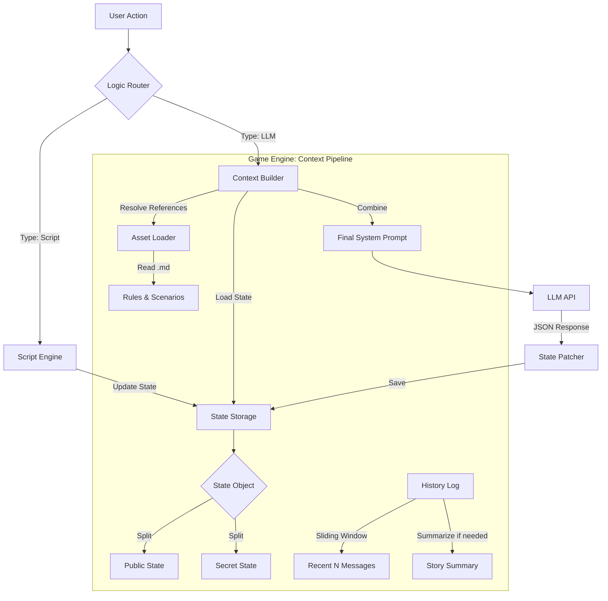

# Architecture Design: LLM Context Pipeline

## 1. Overview

Этот документ описывает архитектуру подсистемы **LLM Context Pipeline** — компонента `Game Engine`, отвечающего за формирование входных данных (Context) для языковой модели.

Цель пайплайна: Обеспечить LLM всей необходимой информацией для принятия игрового решения, минимизируя количество токенов и скрывая секретную информацию от пользователя, но не от модели.

## 2. Data Flow Diagram

Процесс обработки хода игрока:



## 3. Pipeline Stages

### Stage 1: Reference Resolution (Asset Loading)
*   **Input:** Manifest `assets` section (e.g., `{"rules": "assets/rules.md"}`).
*   **Process:**
    1.  Engine считывает указанные Markdown-файлы из файловой системы или бандла игры.
    2.  Кэширует контент (оптимизация).
*   **Output:** Словарь `assets_content: { "rules": "# Game Rules...", "scenario": "..." }`.

### Stage 2: State Splitting & Pruning
*   **Input:** Full Game State JSON.
*   **Process:**
    1.  Разделение на `public` и `secret` ветки (виртуальное, LLM видит обе, но понимает разницу).
    2.  Применение **Whitelist** (если настроен в манифесте): удаление полей, не указанных в `engine.context.include`.
*   **Output:** Оптимизированный JSON стейта.

### Stage 3: History Management
*   **Input:** Лог всех сообщений сессии.
*   **Process:**
    1.  **Sliding Window:** Берем последние $N$ сообщений.
    2.  **Injection:** Добавляем текущее `summary` (сгенерированное ранее).
*   **Output:** Список сообщений для чата (`messages` array).

### Stage 4: Prompt Assembly
*   **Input:** System Prompt Template (из манифеста), Assets Content, State JSON, History.
*   **Process:**
    1.  В System Prompt заменяются плейсхолдеры вида `{{assets.rules}}` на реальный текст из MD-файлов.
    2.  В конец System Prompt (или отдельным сообщением `system`) добавляется текущий JSON стейта.
*   **Output:** Финальный запрос к API модели.

## 4. Configuration (Manifest)

```json
"assets": {
  "rules": "docs/combat_rules.md",
  "lore": "docs/world_lore.md"
},
"engine": {
  "system_prompt": "You are the GM. Rules: {{assets.rules}}. World: {{assets.lore}}...",
  "context": {
    "include": ["state.public.hp", "state.secret.boss_hp"],
    "history_window": 15
  }
}
```
