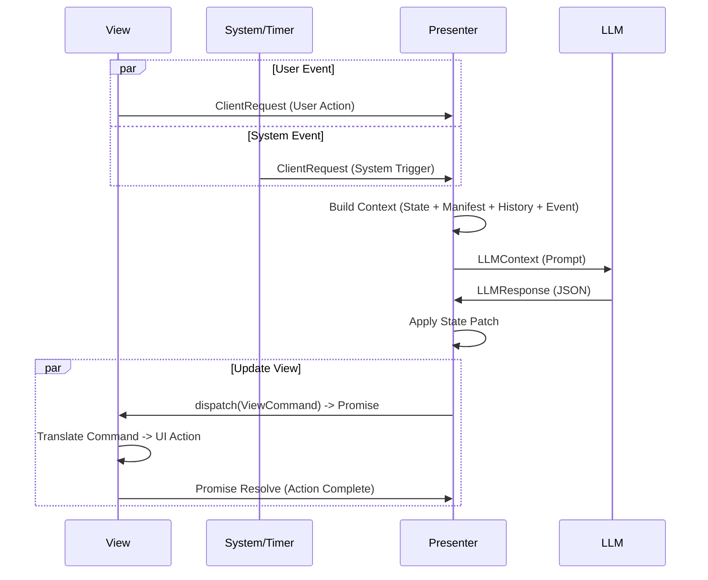

# MVP Interaction Protocol

This document defines the communication protocol between the View (User Interface), the Presenter (Orchestrator), and the Model (LLM Game Engine) for the MVP architecture.

## High-Level Flow

The architecture follows a uni-directional data flow where events (User or System) trigger a state update via the LLM.



## 1. Client/System <-> Presenter

The Presenter receives events from two sources: the **View** (user interactions) and the **System** (timers, scheduled events, NPC turns). Both use a unified `ClientRequest` structure.

### ClientRequest Structure

```typescript
interface ClientRequest {
  /**
   * Source of the event.
   * - 'user': Initiated by human interaction (click, type).
   * - 'system': Initiated by internal game loop (timer, trigger).
   */
  source: 'user' | 'system';

  /**
   * The specific action or event type.
   * Examples: 'click_card', 'end_turn', 'tick_1s', 'npc_move'.
   */
  type: string;

  /**
   * Optional data associated with the event.
   */
  payload?: Record<string, any>;

  /**
   * Client-side timestamp (ISO 8601).
   */
  timestamp: string;
}
```

### Examples

**User clicks a card:**
```json
{
  "source": "user",
  "type": "play_card",
  "payload": {
    "card_id": "card_123",
    "target_slot": "slot_1"
  },
  "timestamp": "2023-10-27T10:00:00Z"
}
```

**System timer tick:**
```json
{
  "source": "system",
  "type": "tick",
  "payload": {
    "elapsed_ms": 1000
  },
  "timestamp": "2023-10-27T10:00:01Z"
}
```

## 2. Presenter -> LLM

The Presenter constructs a prompt for the LLM. This prompt acts as the `LLMContext`. It must provide enough information for the LLM to adjudicate the action.

### LLMContext Structure

The exact format is a text prompt, but it logically contains these JSON sections:

```typescript
interface LLMContext {
  /**
   * Relevant sections of the Game Manifest (Rules, Card definitions).
   * This may be truncated or summarized based on context length.
   */
  manifest_extract: object;

  /**
   * The current state of the game world.
   */
  game_state: object;

  /**
   * Recent history of events (optional, for coherence).
   */
  history?: ClientRequest[];

  /**
   * The specific event to process now.
   */
  current_event: ClientRequest;
}
```

### Context Assembly Strategy

1.  **System Prompt**: "You are the Game Engine. You manage state based on the Manifest rules..."
2.  **Manifest Injection**: Inject relevant rules (e.g., "Combat Rules", "Card Definitions").
3.  **State Injection**: JSON dump of `gameState`.
4.  **Event Injection**: "Incoming Event: <JSON of current_event>"
5.  **Instruction**: "Output valid JSON in the specified format."

## 3. LLM -> Presenter

The LLM must reply with a structured JSON object (JSON Mode). This response dictates how the game state changes and what the user sees.

### LLMResponse Structure

```typescript
interface LLMResponse {
  /**
   * Chain-of-thought reasoning. The LLM explains why it is making these changes.
   * Useful for debugging and potentially for showing "Game Log" to user.
   */
  thought: string;

  /**
   * State update payload.
   *
   * Base format: JSON Merge Patch (RFC 7396) — a partial object that is recursively merged into the current state.
   * Optional format: JSON Patch (RFC 6902) — a list of operations with JSON Pointer paths (kept as an optional extension).
   *
   * Notes:
   * - With RFC 7396 arrays are replaced as a whole; `null` means "remove the key from the target object".
   * - RFC 6902 is more precise but harder for LLMs to generate correctly.
   */
  state_merge_patch?: Record<string, any>;
  state_json_patch?: { op: string; path: string; value?: any; from?: string }[];

  /**
   * Ordered list of side-effects for the Frontend.
   * These are transient and not persisted in state (animations, toasts, sounds).
   */
  ui_events?: UIEvent[];
}

interface UIEvent {
  type: string; // e.g., 'animate', 'toast', 'sound', 'navigate'
  payload?: Record<string, any>;
}
```

### Examples

**Successful Move:**
```json
{
  "thought": "User played 'Fireball'. User has 10 mana, cost is 5. Move is valid. Deal 3 damage to enemy.",
  "state_update": {
    "player": {
      "mana": 5
    },
    "enemy": {
      "health": 7
    },
    "board": {
      "discard_pile": ["card_fireball"]
    }
  },
  "ui_events": [
    { "type": "animate_fx", "payload": { "effect": "explosion", "target": "enemy_1" } },
    { "type": "toast", "message": "Fireball deals 3 damage!" }
  ]
}
```

## 4. Abstract View Layer (Presenter -> View)

To support multiple frontends (Web, Telegram, CLI), the Presenter communicates with the View through an **Abstract View Gateway**. This decouples the game logic from rendering details.

### Protocol: Command Pattern + Promises

The Presenter sends abstract commands to the View via a unified `dispatch` method. The View returns a `Promise` that resolves when the action is visualy complete (e.g., animation finished).

#### 4.1 Gateway Interface

```typescript
interface IViewGateway {
  /**
   * Dispatches a command to the View.
   * Returns a Promise that resolves when the View has finished processing the command
   * (e.g., animation ended, user closed modal).
   */
  dispatch(command: ViewCommand): Promise<ViewResponse>;
}
```

#### 4.2 ViewCommand Structure

```typescript
interface ViewCommand {
  /**
   * The abstract action type.
   * Examples: 'SYNC_STATE', 'PLAY_FX', 'SHOW_DIALOG', 'NAVIGATE'.
   */
  type: string;

  /**
   * Data required to execute the command.
   */
  payload: Record<string, any>;

  /**
   * Optional metadata (e.g., intended duration, priority).
   */
  meta?: {
    duration?: number;
    priority?: 'high' | 'normal' | 'background';
    [key: string]: any;
  };
}
```

#### 4.3 ViewResponse Structure

```typescript
interface ViewResponse {
  /**
   * Status of the command execution.
   */
  status: 'COMPLETED' | 'INTERRUPTED' | 'FAILED';

  /**
   * Optional result data (e.g., user choice in a dialog).
   */
  payload?: any;
}
```

### 4.4 Translation Layer (The "Manifest" Approach)

The View is responsible for mapping abstract commands to concrete actions. This is typically done via a **View Manifest** or configuration.

**Example Flow:**

1.  **Presenter**: Sends `{ type: "MOVE_UNIT", payload: { id: "hero", to: "forest" } }`.
2.  **Web View**:
    *   Looks up "MOVE_UNIT" in `WebViewManifest`.
    *   Finds: `Unit.animateWalk(target, duration: 2s)`.
    *   Executes PixiJS animation.
    *   Resolves Promise after 2s.
3.  **Telegram View**:
    *   Looks up "MOVE_UNIT" in `TelegramViewManifest`.
    *   Finds: `Bot.sendMessage("Hero is moving to the forest...")`.
    *   Sends message.
    *   Resolves Promise immediately.

## 5. Scenarios

### Scenario A: User Turn

1.  **User** clicks "Attack" button.
2.  **View** sends: `{ "source": "user", "type": "attack", "payload": { "target": "goblin" } }`.
3.  **Presenter** receives event.
4.  **Presenter** fetches `GameState` (Hero HP: 10, Goblin HP: 5).
5.  **Presenter** calls LLM with context:
    *   Rules: "Attacks deal 2 dmg."
    *   State: Hero HP 10, Goblin HP 5.
    *   Event: User attacks Goblin.
6.  **LLM** responds:
    *   Thought: "Hero attacks Goblin. Goblin takes 2 dmg."
    *   State Update: `{ "enemies": { "goblin": { "hp": 3 } } }`.
    *   UI Events: `{ "type": "damage_text", "payload": { "value": 2, "target": "goblin" } }`.
7.  **Presenter** updates local state -> Hero HP 10, Goblin HP 3.
8.  **Presenter** calls `view.dispatch({ type: 'SYNC_STATE', payload: newState })`.
9.  **Presenter** calls `view.dispatch({ type: 'PLAY_FX', payload: { effect: 'damage', target: 'goblin', value: 2 } })`.
10. **View** plays damage animation.

### Scenario B: Long-Running Action (Train Travel)

1.  **Model** says: Train trip takes 3 turns.
2.  **Turn 1**:
    *   Presenter sends: `{ type: "SYNC_TRAIN", payload: { id: "train_1", progress: 0, status: "DEPARTING" } }`.
    *   View starts "Leaving Station" animation.
3.  **Turn 2**:
    *   Presenter sends: `{ type: "SYNC_TRAIN", payload: { id: "train_1", progress: 0.5, status: "TRAVELING" } }`.
    *   View sees change (0 -> 0.5) and animates train moving across the map.
4.  **Turn 3**:
    *   Presenter sends: `{ type: "SYNC_TRAIN", payload: { id: "train_1", progress: 1.0, status: "ARRIVED" } }`.
    *   View plays "Arrival" animation.
